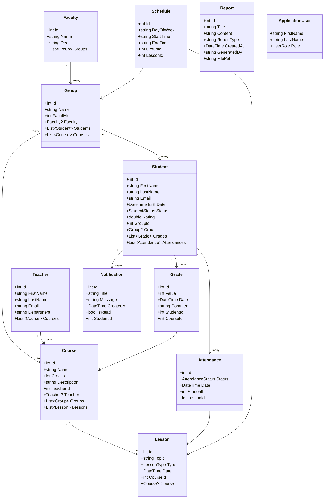
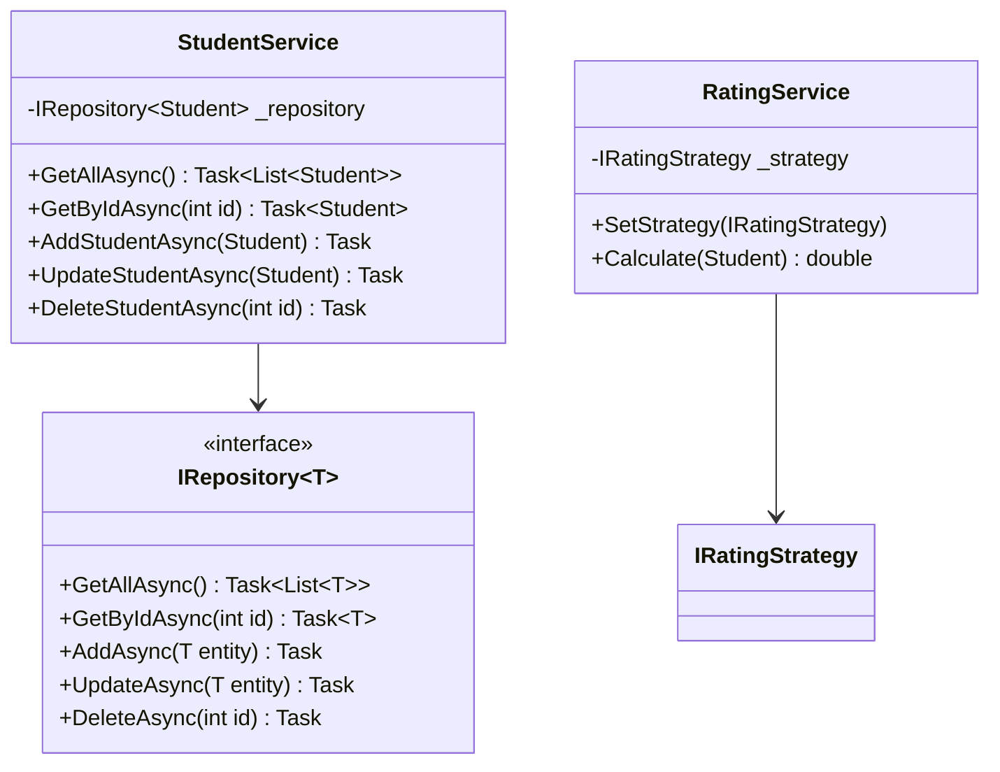

# Діаграма класів — Lumina University Management System

## Доменна модель

```mermaid
classDiagram
    class Student {
        +int Id
        +string FirstName
        +string LastName
        +string Email
        +DateTime BirthDate
        +StudentStatus Status
        +double Rating
        +int GroupId
        +Group? Group
        +List~Grade~ Grades
        +List~Attendance~ Attendances
    }

    class Teacher {
        +int Id
        +string FirstName
        +string LastName
        +string Email
        +string Department
        +List~Course~ Courses
    }

    class Course {
        +int Id
        +string Name
        +int Credits
        +string Description
        +int TeacherId
        +Teacher? Teacher
        +List~Group~ Groups
        +List~Lesson~ Lessons
    }

    class Faculty {
        +int Id
        +string Name
        +string Dean
        +List~Group~ Groups
    }

    class Group {
        +int Id
        +string Name
        +int FacultyId
        +Faculty? Faculty
        +List~Student~ Students
        +List~Course~ Courses
    }

    class Lesson {
        +int Id
        +string Topic
        +LessonType Type
        +DateTime Date
        +int CourseId
        +Course? Course
    }

    class Grade {
        +int Id
        +int Value
        +DateTime Date
        +string Comment
        +int StudentId
        +int CourseId
    }

    class Attendance {
        +int Id
        +AttendanceStatus Status
        +DateTime Date
        +int StudentId
        +int LessonId
    }

    class Schedule {
        +int Id
        +string DayOfWeek
        +string StartTime
        +string EndTime
        +int GroupId
        +int LessonId
    }

    class Notification {
        +int Id
        +string Title
        +string Message
        +DateTime CreatedAt
        +bool IsRead
        +int StudentId
    }

    class Report {
        +int Id
        +string Title
        +string Content
        +string ReportType
        +DateTime CreatedAt
        +string GeneratedBy
        +string FilePath
    }

    class ApplicationUser {
        +string FirstName
        +string LastName
        +UserRole Role
    }

    Faculty "1" --> "many" Group
    Group "1" --> "many" Student
    Group "many" --> "many" Course
    Teacher "1" --> "many" Course
    Course "1" --> "many" Lesson
    Student "1" --> "many" Grade
    Student "1" --> "many" Attendance
    Student "1" --> "many" Notification
    Grade --> Course
    Attendance --> Lesson
    Schedule --> Group
    Schedule --> Lesson
```

---

## Патерни проєктування

```mermaid
classDiagram
    class ILessonFactory {
        <<interface>>
        +CreateLesson() Lesson
    }
    class LectureFactory {
        +CreateLesson() Lesson
    }
    class SeminarFactory {
        +CreateLesson() Lesson
    }
    class LaboratoryFactory {
        +CreateLesson() Lesson
    }
    class LessonFactoryProvider {
        +GetFactory(string type) ILessonFactory
    }

    ILessonFactory <|.. LectureFactory
    ILessonFactory <|.. SeminarFactory
    ILessonFactory <|.. LaboratoryFactory
    LessonFactoryProvider --> ILessonFactory

    class IRatingStrategy {
        <<interface>>
        +Calculate(Student) double
    }
    class ExamRatingStrategy {
        +Calculate(Student) double
    }
    class AttendanceRatingStrategy {
        +Calculate(Student) double
    }
    class ScholarshipRatingStrategy {
        +Calculate(Student) double
    }

    IRatingStrategy <|.. ExamRatingStrategy
    IRatingStrategy <|.. AttendanceRatingStrategy
    IRatingStrategy <|.. ScholarshipRatingStrategy

    class ReportBuilder {
        <<abstract>>
        #Report report
        +BuildTitle()*
        +BuildContent()*
        +GetReport() Report
    }
    class PdfReportBuilder {
        +BuildTitle()
        +BuildContent()
    }
    class ExcelReportBuilder {
        +BuildTitle()
        +BuildContent()
    }

    ReportBuilder <|-- PdfReportBuilder
    ReportBuilder <|-- ExcelReportBuilder

    class IUniversityComponent {
        <<interface>>
        +string Name
        +Display(int depth)
    }
    class FacultyComposite {
        +List~IUniversityComponent~ Children
        +Add(IUniversityComponent)
        +Display(int depth)
    }
    class GroupComposite {
        +List~IUniversityComponent~ Children
        +Add(IUniversityComponent)
        +Display(int depth)
    }
    class StudentLeaf {
        +Display(int depth)
    }

    IUniversityComponent <|.. FacultyComposite
    IUniversityComponent <|.. GroupComposite
    IUniversityComponent <|.. StudentLeaf
    FacultyComposite --> IUniversityComponent
    GroupComposite --> IUniversityComponent

    class IVisitor {
        <<interface>>
        +Visit(Student)
        +Visit(Group)
        +Visit(Faculty)
    }
    class RatingVisitor {
        +Visit(Student)
        +Visit(Group)
        +Visit(Faculty)
    }
    class AttendanceVisitor {
        +Visit(Student)
        +Visit(Group)
        +Visit(Faculty)
    }
    class StatisticsVisitor {
        +Visit(Student)
        +Visit(Group)
        +Visit(Faculty)
    }
    class ReportVisitor {
        +Visit(Student)
        +Visit(Group)
        +Visit(Faculty)
    }

    IVisitor <|.. RatingVisitor
    IVisitor <|.. AttendanceVisitor
    IVisitor <|.. StatisticsVisitor
    IVisitor <|.. ReportVisitor

    class TeacherSubject {
        -List~IObserver~ observers
        +Attach(IObserver)
        +Notify(string message)
    }
    class IObserver {
        <<interface>>
        +Update(string message)
    }
    class NotificationObserver {
        +Update(string message)
    }

    TeacherSubject --> IObserver
    IObserver <|.. NotificationObserver
```

---

## Сервісний шар

```mermaid
classDiagram
    class IRepository~T~ {
        <<interface>>
        +GetAllAsync() Task~List~T~~
        +GetByIdAsync(int id) Task~T~
        +AddAsync(T entity) Task
        +UpdateAsync(T entity) Task
        +DeleteAsync(int id) Task
    }

    class StudentService {
        -IRepository~Student~ _repository
        +GetAllAsync() Task~List~Student~~
        +GetByIdAsync(int id) Task~Student~
        +AddStudentAsync(Student) Task
        +UpdateStudentAsync(Student) Task
        +DeleteStudentAsync(int id) Task
    }

    class RatingService {
        -IRatingStrategy _strategy
        +SetStrategy(IRatingStrategy)
        +Calculate(Student) double
    }

    StudentService --> IRepository
    RatingService --> IRatingStrategy
```