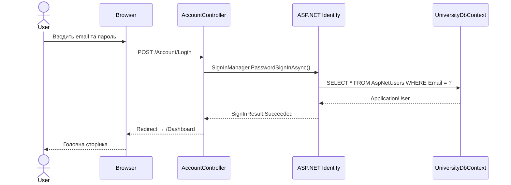
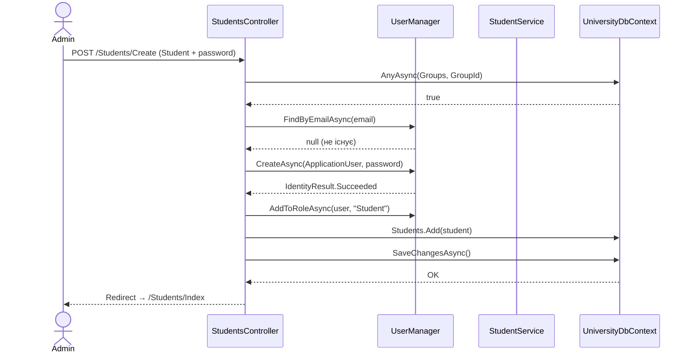
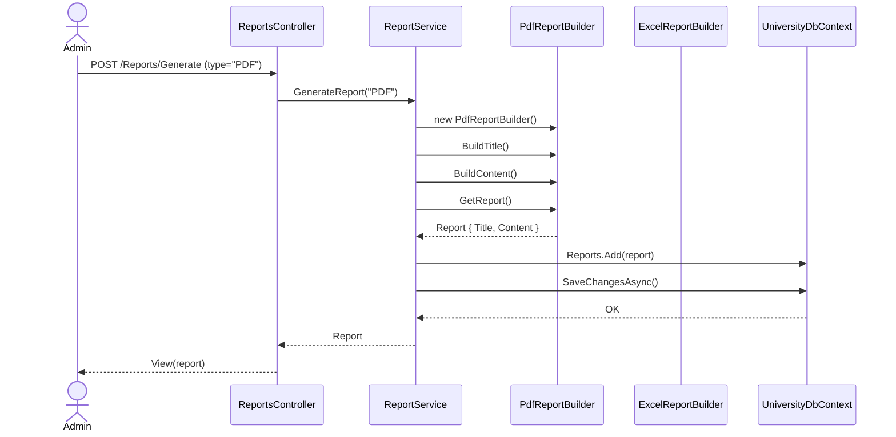
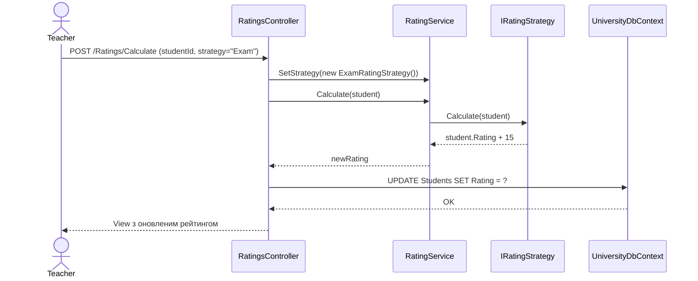
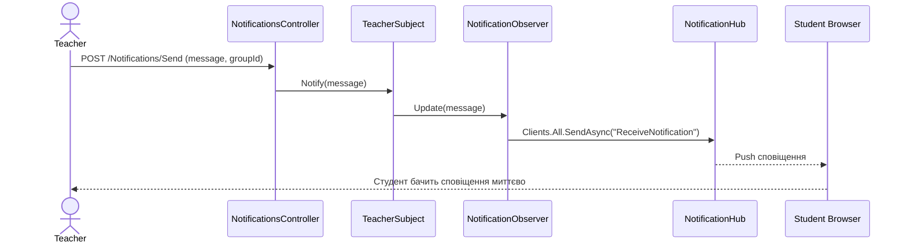
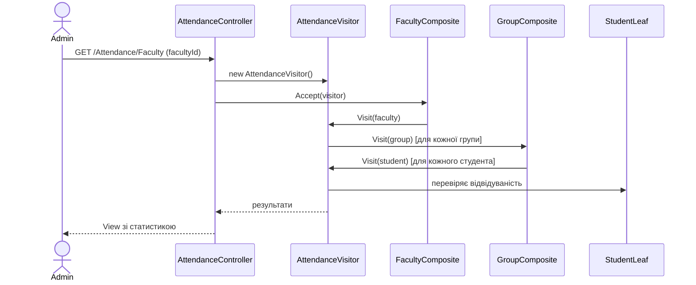
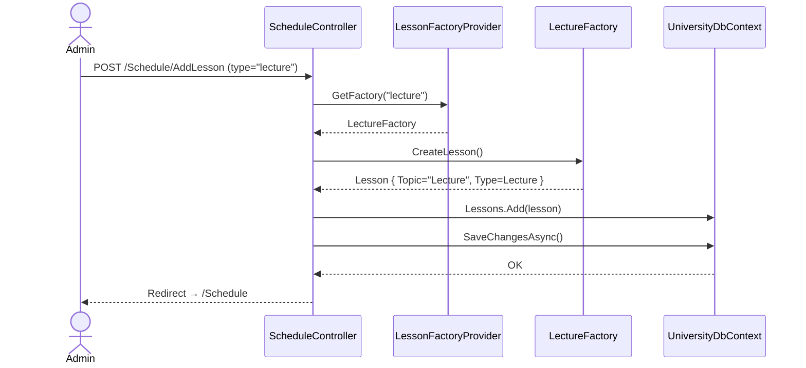

# Sequence Діаграми — Lumina University Management System

## 1. Автентифікація користувача

---

## 2. Створення студента адміністратором

---

## 3. Генерація звіту (Builder Pattern)

---

## 4. Розрахунок рейтингу студента (Strategy Pattern)

---

## 5. Сповіщення в реальному часі (Observer + SignalR)

---

## 6. Відвідуваність (Visitor Pattern)

---

## 7. Створення заняття (Factory Pattern)

